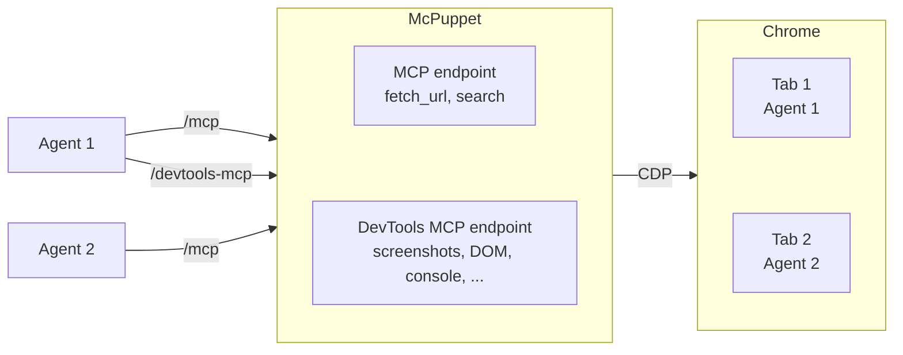

# McPuppet

MCP server that provides AI agents with a local browser. Launches Chrome/Chromium via Puppeteer and exposes tools for web navigation and search. The browser runs in non-headless mode by default.

Each MCP session gets its own browser tab, created on first use and closed when the session ends. Multiple agents can connect at the same time with separate tabs.

Returned content is cleaned: hidden elements and HTML comments are stripped, boilerplate is removed, Mozilla Readability extracts the main article, and the result is converted to Markdown. The output is wrapped in a tagged fence to mark it as untrusted external content.

McPuppet embeds [`chrome-devtools-mcp`](https://github.com/ChromeDevTools/chrome-devtools-mcp) as a second MCP endpoint on the same server to provide the agent with access to Chrome DevTools.




## Tools

### `/mcp`

- `fetch_url`: Navigate to a URL and return extracted Markdown content.
- `search`: Run a web search and return results as Markdown. Optional `page` parameter (1-indexed) for pagination.

### `/devtools-mcp`

Provides DOM inspection, screenshots, console logs, network monitoring, performance tracing, etc. See the [chrome-devtools-mcp tool list](https://github.com/ChromeDevTools/chrome-devtools-mcp/blob/main/docs/tool-reference.md) for details.

## Quick start

```bash
pnpm install
pnpm start
```

Listens on `http://127.0.0.1:5420` by default.

To build:

```bash
pnpm run build
```

Output scripts `dist/mcpuppet-server` and `dist/mcpuppet-cli` can be run directly or copied to PATH. Note: `dist/mcpuppet-server` requires `node_modules` at runtime for `chrome-devtools-mcp`.

## Configuration

All settings are environment variables:

| Variable | Default | Description |
|---|---|---|
| `MCPUPPET_HOST` | `127.0.0.1` | Bind address |
| `MCPUPPET_PORT` | `5420` | HTTP port |
| `MCPUPPET_HEADLESS` | `false` | Run browser headless |
| `MCPUPPET_SLOW_MO` | `0` | ms delay per Puppeteer action (for human observation) |
| `MCPUPPET_MAX_CONNECTIONS` | `10` | Max concurrent sessions |
| `MCPUPPET_REQUEST_TIMEOUT_MS` | `30000` | Page request timeout (msec) |
| `MCPUPPET_SETTLE_DELAY_MS` | `1000` | Max wait after page load for network to settle (msec) |
| `MCPUPPET_MAX_REDIRECTS` | `5` | Max HTTP redirects to follow |
| `MCPUPPET_SEARCH_BACKEND` | `duckduckgo` | Search provider (`google`, `duckduckgo`) |
| `MCPUPPET_LOG_LEVEL` | `info` | Log verbosity (`debug`, `info`, `warn`, `error`) |
| `MCPUPPET_EXECUTABLE_PATH` | _(empty)_ | Path to Chrome/Chromium executable (uses Puppeteer's bundled version if empty) |
| `MCPUPPET_USER_DATA_DIR` | `./.browser-data` | Chrome/Chromium profile (persists cookies across restarts) |
| `MCPUPPET_SESSION_DEBUG_DIR` | _(empty)_ | Directory for session debug dumps (disabled when empty) |
| `MCPUPPET_AUTH_TOKEN` | _(empty)_ | Bearer token for all requests (unauthenticated if unset) |
| `MCPUPPET_DEVTOOLS_MCP` | `true` | Enable chrome-devtools-mcp endpoint at `/devtools-mcp` |

Use environment variables directly or load from a file. See [`.env.example`](.env.example) as a template.

To use a custom env file:

```
node --strip-types --env-file=mysettings.env src/main.ts
```

> [!WARNING]
> When `MCPUPPET_AUTH_TOKEN` is not set the server accepts all requests without authentication. Intended for localhost use only (`MCPUPPET_HOST=127.0.0.1`). Do not expose on a network interface without setting a token.

> [!NOTE]
> **Ubuntu 23.10+:** Puppeteer's bundled Chromium fails with `No usable sandbox!` due to [AppArmor user namespace restrictions](https://github.com/puppeteer/puppeteer/issues/12818). McPuppet automatically prefers `/opt/google/chrome/chrome` on Linux when available. You can also set `MCPUPPET_EXECUTABLE_PATH`.

## Adding to Kiro

Add to `mcpServers` in `~/.kiro/agents/<agent>.json`:

```json
{
  "mcpServers": {
    "mcpuppet": {
      "url": "http://127.0.0.1:5420/mcp"
    },
    "chrome-devtools": {
      "url": "http://127.0.0.1:5420/devtools-mcp"
    }
  }
}
```

Add `"@mcpuppet/*"` and `"@chrome-devtools/*"` to the agent's `tools` and `allowedTools` arrays.

## Adding to Antigravity CLI

Add to `~/.gemini/config/mcp_config.json` (global) or `.agents/mcp_config.json` (workspace):

```json
{
  "mcpServers": {
    "mcpuppet": {
      "serverUrl": "http://127.0.0.1:5420/mcp"
    },
    "chrome-devtools": {
      "serverUrl": "http://127.0.0.1:5420/devtools-mcp"
    }
  }
}
```

## Adding to Pi Coding Agent

Pi has no built-in MCP support. Use the [MCP extension](https://github.com/tsaarni/agent-skills/tree/main/pi-coding-agent/extensions/mcp) to add it.

Add to `~/.pi/agent/mcp.json` (global) or `.pi/mcp.json` (project-local):

```json
{
  "mcpServers": {
    "mcpuppet": {
      "url": "http://127.0.0.1:5420/mcp"
    },
    "chrome-devtools": {
      "url": "http://127.0.0.1:5420/devtools-mcp"
    }
  }
}
```

Global config loads automatically. Project-local config requires `/mcp-enable-project` in the session.

## Using via agent skills (without MCP)

For environments without MCP support, use the CLI client `mcpuppet-cli` ([`src/cli.ts`](src/cli.ts)) to communicate with the server.

Example skill file:

```markdown
---
name: mcpuppet
description: Fetch web pages and run web searches via a local browser. Use when you need to read documentation or search the internet.
---

Use following commands to interact with the browser:

- `mcpuppet-cli fetch <url>` — Fetch a web page
- `mcpuppet-cli search <query>` — Run a web search
```

## Contributing

See [CONTRIBUTING.md](CONTRIBUTING.md).
